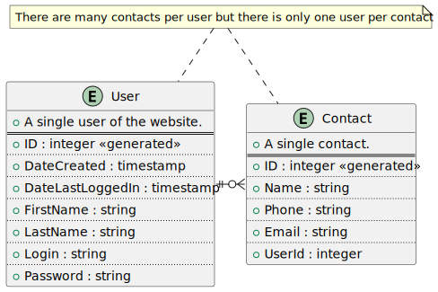

<!-- center -->

<!-- backgroundColor: #fcf99a; -->

# The Yellow Book

# 

It's like a phonebook.

---

<!-- backgroundColor: white -->

There's no stronger bond than friendship.

---

# Team Members

Tyler Angley [@constellationz](https://github.com/constellationz) Project Manager

Hunter Smith [@hunt3r-s](https://github.com/hunt3r-s) HTML/CSS

Christian Lopez [@CLMMS](https://github.com/CLMMS) HTML/JavaScript

Khalil Oxborough [@koxborough](https://github.com/koxborough) JavaScript & API

Sophia Deangelo[@SopaKitchen](https://github.com/SopaKitchen) API and database

---

# What went well?

The good, the bad, and the ugly
 
---
 
### Technologies Used

 Linode (Hosting)
 Marp (Presentation)
 PlantUML (UML diagrams)
 Postman (API iteration)
 GitHub 🤝  Git
 GoDaddy
 Discord
 Trello
 SwaggerHub

---

#### Gantt Chart

---

#### Entity Relationship Diagram

---

#### Use Case Diagram

---

# API Demonstration

[API Demonstration on SwaggerHub](https://app.swaggerhub.com/apis/SOPHIAD/Contacts/1.0.0)

[Backup Video](https://www.youtube.com)

---

# Live Demo!

[Take me to The Yellow Book](http://theyellowbookcop4331.com)

---

# Any questions?

# 